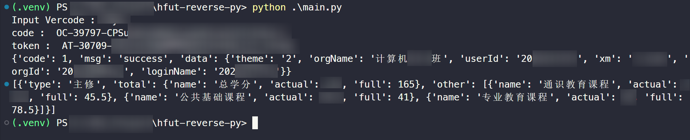

# 合肥工业大学 CAS 登录逆向

## 声明

本项目仅用于 **学习、研究和个人自动化** 目的，所有操作均在用户本地环境执行，本仓库不会收集或传输任何个人信息（如学号、密码等）。

请严格遵守学校及相关法律法规，切勿将本项目用于 **未经授权的商业或他人账户操作**。

作者对因使用本项目进行的任何违规行为 **不承担法律责任**。使用者须自行承担操作风险，并对自己的行为负责。

⚠️ 强烈建议仅在 **个人账户和自有设备** 上使用，避免在公共或他人设备上输入敏感信息。


## 这是什么

通过抓包分析登录逻辑，从而达到直接调用API完成登录合肥工业大学官网的作用。可以用于第三方软件开发。

## 如何使用

首先克隆并进入此仓库：

```bash
git clone https://github.com/Tuning-Luna/hfut-xc-login-reverse.git
cd hfut-xc-login-reverse
```


安装依赖项

```bash
python -m pip install -r requirements.txt -i https://pypi.tuna.tsinghua.edu.cn/simple
```


在当前目录下新建 `.env` 环境配置文件，用于输入你的学号，密码（**你本项目所有代码均在本地执行，不会向任何第三方服务器上传你的学号或密码**。）

```env
// .env
student_id = "202xxxxxxx"
password = "YourPassword"
```


如果想要手动输入，可以在 [main.py 14-18行](./main.py) 把`getenv` 注释掉，然后启用下方的输入学号密码

```python
load_dotenv()

student_id = os.getenv("student_id")
password = os.getenv("password")

# student_id = input("请输入学号：")
# password = input("请输入密码：")
```


运行[main.py](./main.py)文件 :

```bash
python main.py
```


然后会调用系统看图工具打开验证码，在终端正确的输入验证码即可（OCR未找到合适模型，暂时手动输入）


你会在终端看到你的敏感信息，比如姓名，培养情况等（这些信息来自你登录后的官方接口，本仓库不会保存或外传），这就意味着登录成功。如下图所示：

其它 CAS 统一身份认证后的服务接口，你可以根据自己的需求继续调用。请自行体会或者问LLM，或者提Issue，看到了我会回复。

